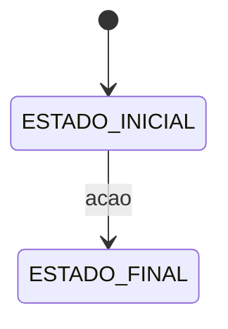

# Template — Cenário de Orquestração

Use este template para fluxos que **cruzam módulos**. Copie para `docs/domains/orchestration/{nome}.md`.

---

# {Nome do Cenário}

## Classificação

- **Tipo:** Orquestração cross-domain
- **Status:** Implementado | Planejado
- **Trigger:** {API REST | Job @Scheduled | Webhook | Evento externo}

## Objetivo

{1–2 frases: o que o fluxo entrega ao negócio e quando termina.}

## Domínios e fronteiras

| Módulo       | Papel neste fluxo  | Dono do processo? |
|--------------|--------------------|-------------------|
| `{domain-*}` | {responsabilidade} | Sim / Não         |

**Anti-requisitos:**

- {Ex.: supporting domain não decide liberação de login}
- {Ex.: não importar `infra/` de outro módulo}

## Estados / invariantes

{Máquina de estados ou lista de invariantes.}



- {Invariante 1}
- {Invariante 2}

## Sequência

| # | Passo       | Tipo         | Módulo   | Notas                       |
|---|-------------|--------------|----------|-----------------------------|
| 1 | {descrição} | Sync / Async | {módulo} | {compensação, idempotência} |

## Eventos

| Evento        | Publicado por | Consumido por | Payload relevante |
|---------------|---------------|---------------|-------------------|
| `{EventName}` | {módulo}      | {listener}    | {campos}          |

- Idempotência: {como garantir — ex. `correlationId`, `event_publication`}

## Compensação / falhas

| Falha                   | Comportamento                   |
|-------------------------|---------------------------------|
| {Keycloak indisponível} | {rollback / retry / estado}     |
| {Webhook duplicado}     | {idempotente por correlationId} |
| {SMTP falhou}           | {event_publication retry}       |

## Estrutura proposta (placeholder)

```
backend/domain-{context}/src/main/java/.../
  {subdominio}/
    app/impl/{Process}ServiceImpl.java    # process manager ou orquestrador
    domain/event/
    infra/{Module}Listeners.java
```

## Contratos

### REST

| Método | Path          | Descrição |
|--------|---------------|-----------|
| POST   | `/api/v1/...` | {trigger} |

### Eventos (payloads esboço)

```java
record {EventName}(
UUID sujeitoId,
String correlationId
){}
```

## Testes sugeridos

- `{Service}Test` — transições de estado, guards, compensação
- `{Listeners}Test` — consumo de eventos
- Integração Modulith — fronteiras `allowedDependencies`

## Anti-patterns

- God service em um módulo orquestrando responsabilidades de outro bounded context
- Supporting domain decidindo liberação de login ou chamando Keycloak diretamente
- Import de `infra/` de outro módulo
- Chamada síncrona service-to-service para efeitos colaterais que deveriam ser eventos

## Referências

- [Orquestração — índice](README.md)
- {links para subdomínios relacionados}
