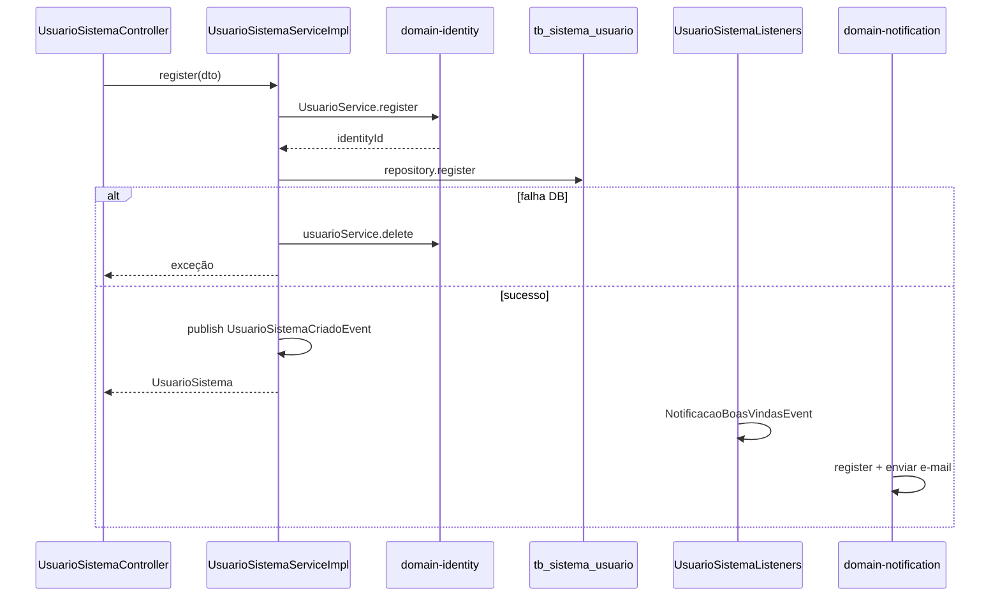

# Cadastro Usuário Backoffice (Usuario Sistema)

## Classificação

- **Tipo:** Orquestração cross-domain
- **Status:** **Implementado**
- **Trigger:** `POST /api/v1/sistema/usuario`

## Objetivo

Cadastrar um **operador backoffice**: criar identidade no Keycloak, persistir metadados locais e disparar e-mail de
boas-vindas. Referência mínima para padrões de orquestração do starter.

> **Nomenclatura:** nas specs, **backoffice** = `domain-backoffice` + `UsuarioSistema` (operadores da plataforma).

## Domínios e fronteiras

| Módulo                | Papel                                                                            | Dono do processo? |
|-----------------------|----------------------------------------------------------------------------------|-------------------|
| `domain-backoffice`   | Validação SentinelFlow, persistência `tb_sistema_usuario`, publicação de eventos | **Sim**           |
| `domain-identity`     | Criação/remoção de usuário Keycloak (`UsuarioService`)                           | Não (port)        |
| `domain-notification` | E-mail boas-vindas via eventos                                                   | Não (listener)    |

## Sequência

| # | Passo                                            | Tipo                | Módulo               | Notas                                                   |
|---|--------------------------------------------------|---------------------|----------------------|---------------------------------------------------------|
| 1 | Validar request (SentinelFlow + Bean Validation) | Sync                | admin                | `UsuarioSistemaRegisterValidator`                       |
| 2 | Criar usuário Keycloak                           | Sync                | admin → identity     | `UsuarioService.register`, `TipoAcesso.USUARIO_SISTEMA` |
| 3 | Persistir `UsuarioSistema` local                 | Sync                | admin                | Vincula `identityId`                                    |
| 4 | Publicar `UsuarioSistemaCriadoEvent`             | Sync (transacional) | admin                | Dentro da mesma `@Transactional`                        |
| 5 | Republicar `NotificacaoBoasVindasEvent`          | Async (listener)    | admin → notification | `UsuarioSistemaListeners`                               |
| 6 | Registrar e enviar notificação                   | Async               | notification         | `NotificacaoEventListeners` → SMTP                      |

### Compensação (passo 2–3)

Se a persistência local falhar após criar no Keycloak, `UsuarioSistemaServiceImpl` **deleta** o usuário na identity
antes de relançar a exceção.



## Eventos

| Evento                       | Publicado por    | Consumido por               | Propósito                       |
|------------------------------|------------------|-----------------------------|---------------------------------|
| `UsuarioSistemaCriadoEvent`  | admin            | `UsuarioSistemaListeners`   | Gatilho boas-vindas             |
| `NotificacaoBoasVindasEvent` | admin (listener) | `NotificacaoEventListeners` | Contrato `notification::events` |
| `NotificacaoRegisterEvent`   | notification     | `NotificacaoEventListeners` | Envio SMTP                      |

- Outbox transacional: tabela `event_publication` (Liquibase + Modulith JPA)

## Estrutura de código (existente)

```
backend/domain-backoffice/.../usuarios/
  app/impl/UsuarioSistemaServiceImpl.java   # orquestração síncrona + compensação
  infra/UsuarioSistemaListeners.java        # ponte para notification
backend/domain-notification/.../
  infra/NotificacaoEventListeners.java
```

## Contratos

### REST

| Método | Path               | Descrição                    |
|--------|--------------------|------------------------------|
| POST   | `/sistema/usuario` | Cadastrar usuário backoffice |

Detalhes: [usuario-sistema.md](../core/iam/usuario-sistema.md)

## Testes

| Classe                          | Cobertura                |
|---------------------------------|--------------------------|
| `UsuarioSistemaServiceImplTest` | register, compensação    |
| `UsuarioSistemaListenersTest`   | republicação boas-vindas |
| `UsuarioSistemaControllerTest`  | contrato HTTP            |

## Padrões reutilizáveis

| Padrão                         | Quando aplicar                                              |
|--------------------------------|-------------------------------------------------------------|
| Compensação identity + local   | Criar recurso externo e persistir local; rollback se falhar |
| Eventos para notification      | Efeitos colaterais desacoplados via `notification::events`  |
| Listeners no módulo consumidor | Preferir coreografia a chamada síncrona service-to-service  |

## Anti-patterns

- Chamar `NotificacaoService` diretamente de `domain-backoffice` (preferir eventos)

## Referências

- [usuario-sistema.md](../core/iam/usuario-sistema.md)
- [notificacao.md](../supporting/notificacao.md)
- [Orquestração — índice](README.md)
